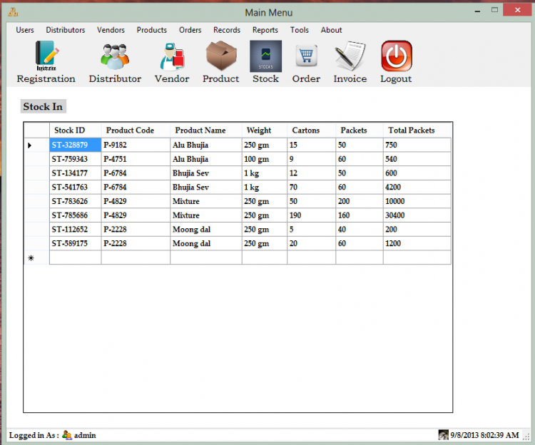

# Sales and Inventory System using VB.NET and MS Access

### Description

This Sales and Inventory System is developed using Visual Basic .NET(Compatibility - Visual Studio 2010 and Visual Studio 2012) and using MS Access 2010 database in the back end. So many users had problems with the SQL server during connection with the database in my last same project(Sales and Inventory System V1.0) so I created a database in MS Access 2010 to help them to run the project successfully.

### Features

<ul>
  <li><b>Customers(Super Distributors) and vendors Profile</b></li>
  <li><b>Orders Processing </b></li>
  <li><b>Inventory Management</b></li>
  <li><b>Invoice Generation</b></li>
  <li><b>Advance Records Searching </b></li>
  <li><b>Advance Reports </b></li>
</ul>

Visit [sourcecodester.com](https://www.sourcecodester.com/visual-basic-net/5583/sales-and-inventory-system-vbnet-ms-access.html) for more detailed information about this Sales and Inventory System.

| Title | Sales and Inventory System using VB.NET and MS Access with Source Code |
|:--|:--|
| Website | [www.sourcecodester.com](https://www.sourcecodester.com) |
| Link | https://www.sourcecodester.com/visual-basic-net/5583/sales-and-inventory-system-vbnet-ms-access.html |
| Language | VB.NET |
| Uploader/Developer | [Raj.Sharma](https://www.sourcecodester.com/users/raj20505) |
